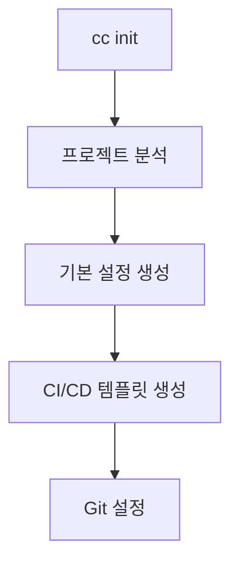
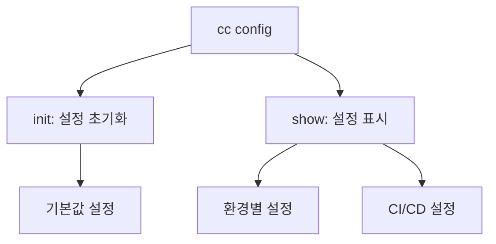
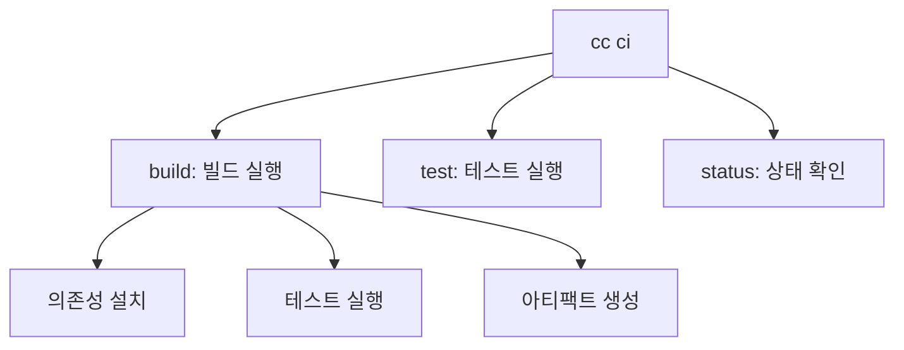
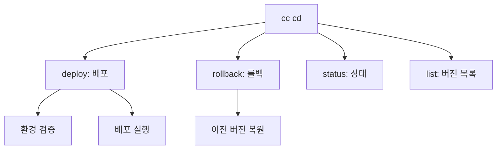
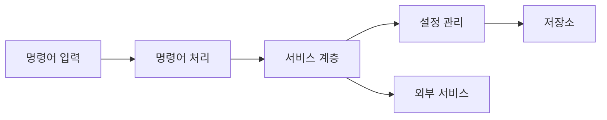
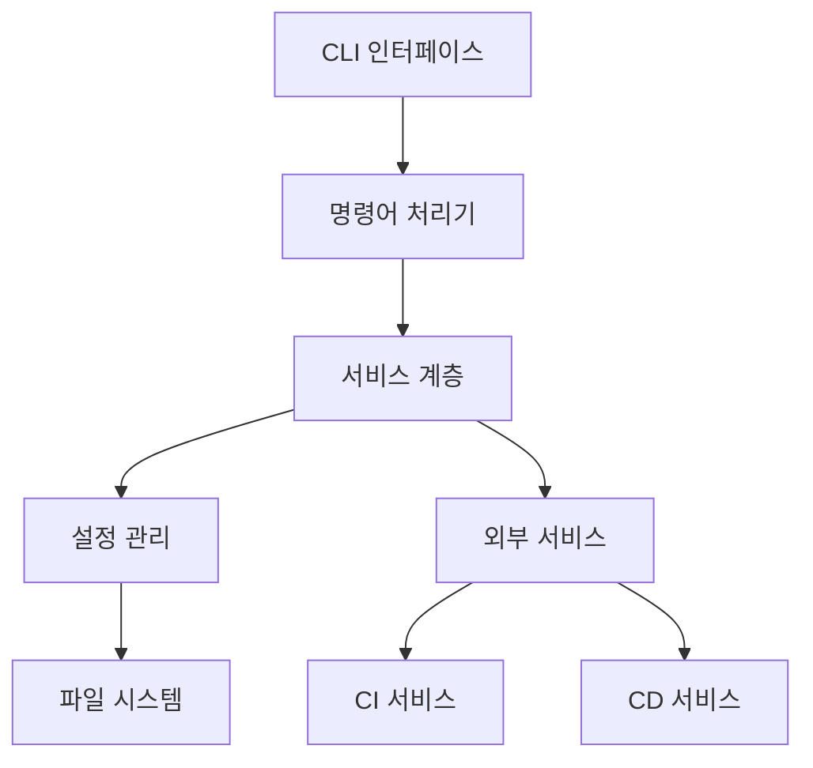

### 1. 기본 명령어 구조

```python
@click.group()
@click.version_option(version="0.2.6")
def main():
    """CI/CD 도구 CLI"""
    setup_logging()

# 명령어 등록
main.add_command(init)
main.add_command(ci_group)
main.add_command(cd_group)
main.add_command(config_group)

```

### 2. 주요 실행 흐름

#### 2.1 초기화 단계


#### 2.2 설정 관리


#### 2.3 CI 파이프라인


#### 2.4 CD 파이프라인


### 3. 핵심 컴포넌트

#### 3.1 명령어 기본 클래스
```python:src/ci_cd_tool/commands/base.py
startLine: 1
endLine: 10
```

#### 3.2 서비스 계층
```python
# 서비스 계층 구조
services/
    ├── build_service.py      # 빌드 관련
    ├── test_service.py       # 테스트 관련
    ├── deploy_service.py     # 배포 관련
    ├── status_service.py     # 상태 관리
    └── initialization_service.py  # 초기화 관련
```

#### 3.3 설정 관리
```python
# 설정 관리 구조
config/
    ├── manager.py           # 설정 관리자
    ├── storage/            # 설정 저장소
    │   ├── file_storage.py
    │   └── memory_storage.py
    └── validators/         # 설정 검증
```

### 4. 데이터 흐름



### 5. 주요 기능별 처리 흐름

#### 5.1 배포 프로세스
```python
def deploy_flow():
    """
    1. 환경 설정 로드
    2. 버전 유효성 검증
    3. 사전 배포 작업
    4. 배포 실행
    5. 사후 배포 검증
    6. 상태 업데이트
    """
```

#### 5.2 테스트 프로세스
```python
def test_flow():
    """
    1. 테스트 환경 설정
    2. 테스트 대상 식별
    3. 테스트 실행
    4. 결과 수집
    5. 리포트 생성
    """
```

### 6. 에러 처리 체계

```python
# 에러 처리 계층
try:
    # 명령어 실행
except CommandError:
    # 명령어 관련 오류
except ConfigError:
    # 설정 관련 오류
except DeployError:
    # 배포 관련 오류
except Exception:
    # 기타 예상치 못한 오류
```

### 7. 전체 아키텍처



### 8. 주요 사용 시나리오

1. **새 프로젝트 설정**
```bash
cc init
cc config show
cc ci test
```

2. **배포 실행**
```bash
cc ci build
cc cd deploy --env prod --version 1.0.0
cc cd status
```

3. **문제 해결**
```bash
cc cd status
cc cd rollback --version 0.9.0
cc cd status
```